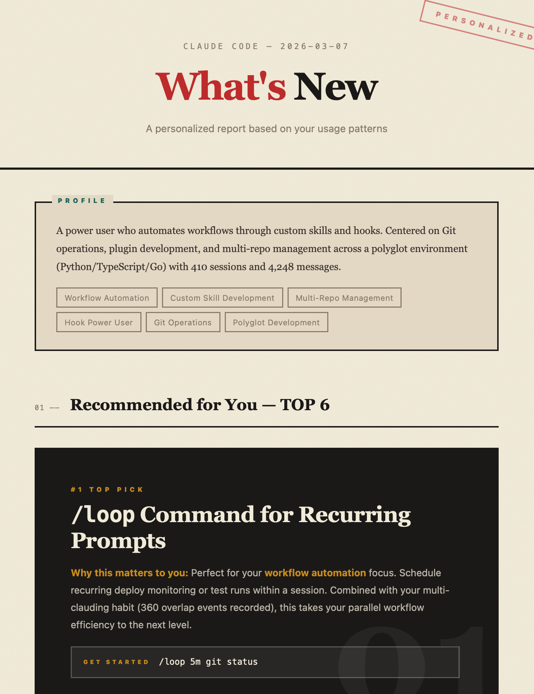

# cc-whatsnew

> **Unofficial community plugin. Not affiliated with Anthropic.**
> Sources: [GitHub CHANGELOG](https://github.com/anthropics/claude-code/blob/main/CHANGELOG.md) · [Release Notes](https://docs.anthropic.com/en/docs/claude-code/release-notes)

A Claude Code plugin that fetches the latest release notes and generates a **personalized** feature report based on your actual usage patterns.

<p align="center">
  
</p>

## Quick Start

```bash
# Install
/plugin marketplace add ni4ta9/cc-whatsnew
/plugin install whatsnew@cc-whatsnew

# Run
/whatsnew
```

Or in natural language:

- "What's new in Claude Code?"
- "Recommend features for me"
- "Claude Code の新機能を教えて"

## Features

- **Personalized Picks** — Top feature recommendations matched against your `/insights` usage profile
- **Categorized Release Notes** — Full changelog with visual badges (New / Improved / Fix / Breaking)
- **Standalone HTML Report** — Beautiful single-file report with Japanese-inspired design, no dependencies
- **Multilingual** — Output language follows your `settings.json` language preference
- **Template Customizable** — Override the HTML template with your own design

## How it works

| Step | What happens |
|------|-------------|
| 1 | Reads your usage profile via `/insights` |
| 2 | Fetches the latest CHANGELOG from GitHub |
| 3 | Matches features to your profile and ranks by relevance |
| 4 | Generates a personalized MD + HTML report |

> `/insights` must have been run at least once. If no profile exists, the skill will prompt you to run it first.

## Output

Reports are generated in the current directory:

| File | Description |
|------|-------------|
| `cc-whatsnew-YYYY-MM-DD.md` | Markdown report |
| `cc-whatsnew-YYYY-MM-DD.html` | Standalone HTML report (open in browser) |

## Multilingual

The report language is determined by the `language` field in `~/.claude/settings.json`.

| `settings.json` value | Output language |
|-----------------------|-----------------|
| `"Japanese"`          | Japanese        |
| `"English"` or unset  | English         |
| Other values          | That language   |

## Template Customization

You can override the default HTML template:

```bash
cp ~/.claude/skills/whatsnew/assets/template.ja.html ~/.claude/whatsnew-template.html
# Edit to your liking
```

To revert to default: `rm ~/.claude/whatsnew-template.html`

See [skills/whatsnew/README.md](skills/whatsnew/README.md) for full template priority details.

## Manual Install

If you prefer not to use the plugin marketplace:

```bash
git clone --depth 1 https://github.com/ni4ta9/cc-whatsnew /tmp/cc-whatsnew
cp -r /tmp/cc-whatsnew/skills/whatsnew ~/.claude/skills/whatsnew
```

Then reload: `/reload-plugins`

## Links

- X: [#ccwhatsnew](https://x.com/hashtag/ccwhatsnew)
- Issues: [GitHub Issues](https://github.com/ni4ta9/cc-whatsnew/issues)
- Detailed docs: [skills/whatsnew/README.md](skills/whatsnew/README.md)

## License

MIT © 2026 ni4ta9
